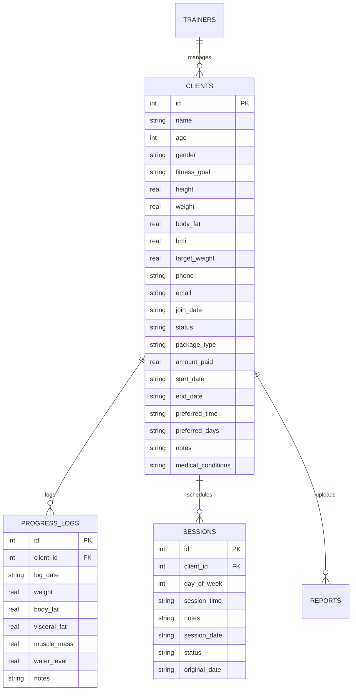

# PulseFit SaaS - System Features & Developer Architecture Documentation

Welcome to the development and feature guide for **PulseFit SaaS**—a premium, responsive personal trainer management platform designed for fitness coaches, gyms, and wellness professionals. 

This document details the application's business features, database models, API design, frontend state mechanics, and user interface styling guidelines.

---

## 1. Project Overview & Business Value

PulseFit SaaS replaces spreadsheets and manual messaging for personal trainers. It provides a central, real-time command dashboard to oversee client workout completions, schedule recurring training templates, log progressive body metric reports, and automate customer billing or WhatsApp check-in alerts.

### Key Value Props:
- **Zero-Dependency High Performance**: Renders rich dynamic widgets (e.g., Donut rings, weekly sparkline bars, and timers) using lightweight, hardware-accelerated inline SVG elements instead of bloated external chart frameworks.
- **Dynamic Mobile Adaptations**: Reorganizes wide grid-based timetables into daily agenda lists with swipe-friendly scroll buttons, allowing coaches to manage check-ins while on the gym floor.
- **Light/Dark Contrast Safety**: Pinned style token schemes automatically adapt font weights and container borders to maintain accessibility compliance on light or dark monitors.

---

## 2. Directory Structure & Tech Stack

```text
gym/
├── db/                  # Persistent database binaries
│   └── database.sqlite  # Main SQLite database file
├── public/              # Front-end Assets (Static Web Server)
│   ├── index.html       # Primary application entrypoint
│   ├── app.js           # Front-end state logic and DOM orchestrator
│   └── style.css        # Vanilla CSS variables, grids, and media queries
├── server.js            # Node.js backend runner, Express API, SQLite drivers
├── package.json         # Project manifests and startup script commands
└── schema.sql           # Database migrations and initial mock datasets
```

### Technology Stack:
1. **Frontend**: Pure HTML5 (semantic structure), Vanilla Javascript (ES6 DOM manipulation and state management), and Vanilla CSS (CSS variables theme engine, CSS Grid/Flexbox).
2. **Backend**: Node.js and Express.js (REST controllers, session auth middleware, static routers).
3. **Database**: SQLite3 (native lightweight file database with quick read-write times).

---

## 3. Database Schema Design

The SQLite relational schema consists of five primary tables, structured to track trainer credentials, active member profiles, historic fitness evaluations, and booked slots.



### 1. `trainers` Table
Holds authenticated coach profiles and credentials.
- `id` (INTEGER, Primary Key)
- `username` (TEXT, Unique)
- `password` (TEXT, Hashed)
- `name` (TEXT)

### 2. `clients` Table
Stores client metadata, physical baselines, membership contracts, and preferred scheduling routines.
- `id` (INTEGER, Primary Key)
- `trainer_id` (INTEGER, Foreign Key referencing `trainers`)
- `name` (TEXT, Required)
- `age` (INTEGER)
- `gender` (TEXT)
- `fitness_goal` (TEXT)
- `height` (REAL)
- `weight` (REAL)
- `body_fat` (REAL)
- `bmi` (REAL)
- `target_weight` (REAL)
- `phone` (TEXT)
- `email` (TEXT)
- `join_date` (TEXT)
- `status` (TEXT: `'active'` or `'inactive'`)
- `package_type` (TEXT: `'Silver'`, `'Gold'`, or `'Platinum'`)
- `amount_paid` (REAL, stored in Indian Rupees `₹`)
- `start_date` (TEXT)
- `end_date` (TEXT)
- `preferred_time` (TEXT: `'HH:MM'`)
- `preferred_days` (TEXT: comma-separated integers, e.g. `'1,3,5'`)
- `notes` (TEXT)
- `medical_conditions` (TEXT)

### 3. `progress_logs` Table
Maintains timeseries fitness history.
- `id` (INTEGER, Primary Key)
- `client_id` (INTEGER, Foreign Key referencing `clients`)
- `log_date` (TEXT)
- `weight` (REAL)
- `body_fat` (REAL)
- `visceral_fat` (REAL)
- `muscle_mass` (REAL)
- `water_level` (REAL)
- `notes` (TEXT)

### 4. `sessions` Table
Maintains scheduled workout slots.
- `id` (INTEGER, Primary Key)
- `client_id` (INTEGER, Foreign Key referencing `clients`)
- `day_of_week` (INTEGER: `1` for Monday through `7` for Sunday)
- `session_time` (TEXT: `'HH:MM'`)
- `notes` (TEXT)
- `session_date` (TEXT: ISO `'YYYY-MM-DD'`)
- `status` (TEXT: `'attended'`, `'missed'`, `'rescheduled'`, or `'upcoming'`)
- `original_date` (TEXT: ISO `'YYYY-MM-DD'`)

### 5. `reports` Table
Stores document attachments (PDFs/Images) uploaded for client profiles.
- `id` (INTEGER, Primary Key)
- `client_id` (INTEGER, Foreign Key referencing `clients`)
- `file_name` (TEXT)
- `file_path` (TEXT)
- `upload_date` (TEXT)

---

## 4. Feature & Interface Breakdown

### 1. Trainer Command Dashboard
Provides the daily overview of training operations:
- **Mixed-Priority Stat Cards**:
  - *Active Clients*: A featured wide-card displaying total client registration numbers, accompanied by a dynamic **SVG Sparkline** rendering check-in ratios over the past 7 days.
  - *Total Registrations, Attendance Rate, and Metrics Logged*: Smaller secondary cards displaying core KPI values.
- **Hourly Workout Timeline**: Pushes upcoming sessions into a chronological timeline with time markers. A sliding **red vertical "NOW" indicator** guides the coach on the active slot.
- **Inactivity Alerts & Empty States**: Shows helpful empty states with checkmarks when there are no logs for the day.
- **Goal Distribution Donut**: A pure SVG Donut Ring chart that displays the share of client goals (e.g., Weight Loss vs. Muscle Gain) with hoverable highlights.

### 2. Client Profile Details & Medical Logs
Maintains a detailed dossier on every member.
- **Physical Profiles**: Displays basic height, weight, BMI values, and target weights.
- **Body Composition**: Tracks visceral fat index, muscle mass (kg), and body water level percentage (%).
- **Coaching Notes & Restrictions**: Pinned tabs highlight medical conditions, asthma records, injuries, or dietary requirements.
- **Document & PDF Upload**: Supports file uploads of medical clearances or scans.

### 3. Timetable & Interactive Scheduling
The calendar is the core coordinator:
- **Alternate-Day Generator**: When adding a new client, selecting their membership tier (Silver/Gold/Platinum) auto-suggests regular slots (e.g., Mon/Wed/Fri for Silver).
- **Desktop Grid Timetable**: Shows an hourly schedule card grid, displaying status emoji badges:
  - ⏳ `Upcoming` (Gray left-border)
  - ✅ `Attended` (Green left-border)
  - ❌ `Missed` (Red left-border)
  - 🔄 `Rescheduled` (Amber left-border)
- **Mobile Agenda View**: Fits the calendar into a single-column layout. Buttons at the top slide to select weekdays, instantly rendering colored cards with the client name, scheduled hour, and targets.
- **Quick-Action Modals**: Click a session card on mobile or desktop to immediately change attendance, reschedule slots, or delete sessions.

### 4. Progress Metrics & Graphs
A dedicated metrics analyzer:
- **Interactive Graph Switches**: Toggle between Weekly (7d), Monthly (30d), and All-Time views.
- **Dynamic Chart Rendering**: Automatically generates line charts tracking Weight Loss progress and bar charts comparing Muscle Mass vs. Water levels.
- **Metric Entry Logger**: Allows logging current metrics to build historical trends.

### 5. Messaging & WhatsApp Alerts
Allows keeping clients updated via templates:
- **WhatsApp Templates**: Includes quick-apply text templates for:
  - *Booking Confirmations*
  - *Reschedule Warnings*
  - *Absent/Missed Notices*
  - *Payment/Membership Reminders*
- **Chat History & Logs**: Shows sent logs in a chat-bubble layout, complete with double-tick visual markers to indicate delivery status.

---

## 5. UI Design System & CSS Variables

PulseFit uses a custom color palette defined using CSS Custom Properties (Variables), ensuring contrast safety across light and dark theme toggles.

### Core Variables (`public/style.css`):
```css
:root {
  --primary: #10b981;          /* Emerald Green Accent */
  --primary-hover: #059669;
  --secondary: #3b82f6;        /* Blue Highlight */
  --bg-dark: #09090e;          /* Canvas Background */
  --bg-card: #12121a;          /* Component Card background */
  --border-color: #1e1e2d;     /* Grid Dividers */
  --text-primary: #ffffff;
  --text-secondary: #94a3b8;
}

/* Light Theme Variables */
[data-theme="light"] {
  --bg-dark: #f8fafc;          /* Light Slate canvas */
  --bg-card: #ffffff;          /* Pure white card backgrounds */
  --border-color: #e2e8f0;     /* Light border divider */
  --text-primary: #0f172a;     /* Dark slate typography */
  --text-secondary: #475569;   /* Muted gray text */
}
```

### Key UI Classes:
- **`.timetable-session-card`**: A styled card with an accent colored border indicating status. Uses a left-border for status (completed = `#10b981`, missed = `#ef4444`, rescheduled = `#f59e0b`, upcoming = `#6b7280`).
- **Rotating Client Themes (`.card-theme-0` through `.card-theme-5`)**: Global utility classes that assign different background colors (Blue, Emerald, Purple, Amber, Pink, Cyan) to timetable sessions and mobile agenda items.
- **Sticky Modals (`.modal-content`)**: Combines a flex column with a fixed header (`flex-shrink: 0`) and footer, making only the modal body scrollable (`overflow-y: auto; flex: 1`). This prevents inputs or text from disappearing when mobile keyboards appear.

---

## 6. Development & Deployment Operations

### How to Run Locally:
1. Ensure Node.js is installed.
2. Install dependencies:
   ```bash
   npm install
   ```
3. Start the application server:
   ```bash
   npm start
   ```
4. Access the application in your browser at `http://localhost:3000`.

### Production Deployment (Render / Cloud Run):
The backend is designed for server-based deployments.
1. Deploy the directory on **Render** (as a Web Service) or deploy via Docker on **Google Cloud Run**.
2. Environment variables needed:
   - `PORT`: Set by hosting providers (defaults to 3000).
   - Database files (`db/database.sqlite`) will automatically initialize if they do not exist.
